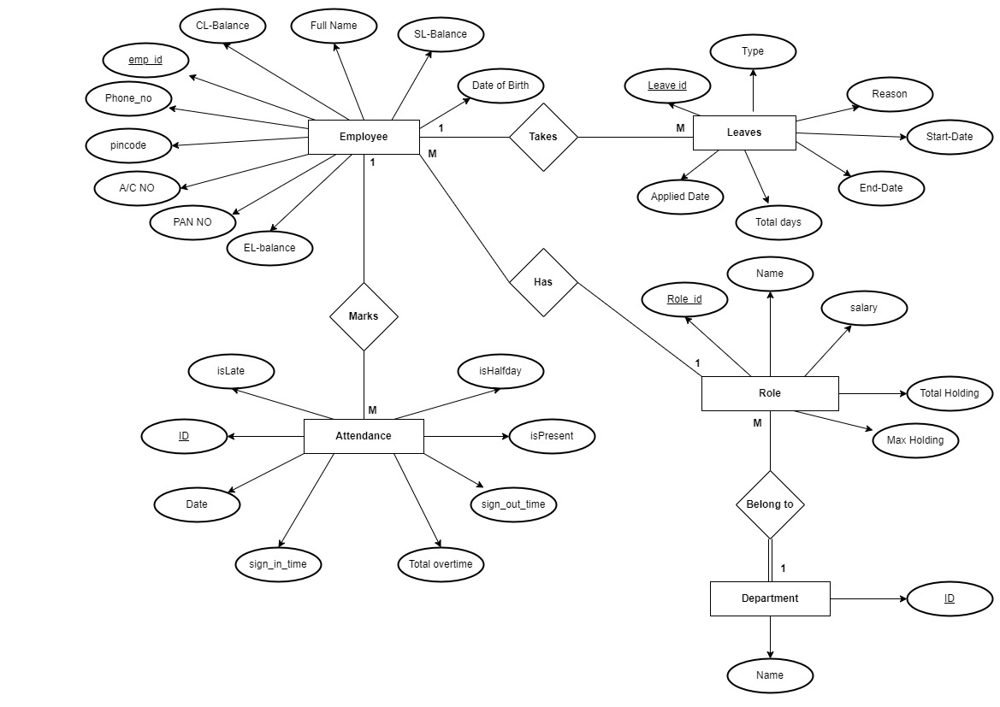
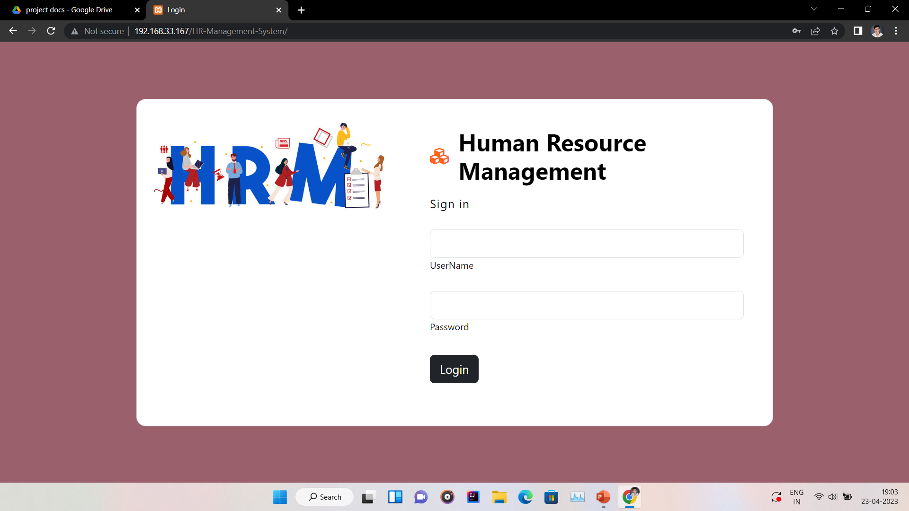

<h1 align="center">🏢 HR Management Software</h1>

    
    
    

<h2>📝 Project Overview</h2>

A comprehensive cloud-based Human Resource Management platform designed to transform workforce management across diverse industries. Leveraging cutting-edge technologies to streamline HR processes and enhance organizational efficiency.

<h2>🚀 Technology Stack</h2>
<table>
    <tr>HR Management and Payroll System
        <td><strong>Frontend</strong></td>
        <td>
            <ul>
                <li>HTML5</li>
                <li>CSS3</li>
                <li>Bootstrap 5.3</li>
            </ul>
        </td>
    </tr>
    <tr>
        <td><strong>Backend</strong></td>
        <td>
            <ul>
                <li>PHP 7</li>
                <li>PostgreSQL</li>
                <li>Promise-based Fetch API</li>
            </ul>
        </td>
    </tr>
</table>
<h2>✨ Core Features</h2>
<h3>1. 📊 Dashboard Management</h3>
<ul>
    <li>Interactive data visualization</li>
    <li>Strategic decision support system</li>
    <li>Comprehensive performance insights</li>
</ul>
<h3>2. 👥 Employee Information System</h3>

    
<strong>Profile Management</strong>

    <ul>
        <li>Create employee records</li>
        <li>Update personnel details</li>
        <li>Delete obsolete entries</li>
    </ul>

    
<strong>Role Assignment</strong>

    <ul>
        <li>Flexible role creation</li>
        <li>Controlled role assignments</li>
        <li>Limit mechanism for role allocation</li>
    </ul>

<h3>3. 📅 Leave Management Module</h3>

    <strong>Leave Types Supported:</strong>
    <ul>
        <li>🟢 Earned Leave (Privilege Leave)</li>
        <li>🔵 Casual Leave</li>
        <li>🔴 Sick Leave</li>
    </ul>

<h3>4. 🕒 Attendance Tracking System</h3>

    <strong>Attendance Classifications:</strong>
    <ul>
        <li>✅ Present</li>
        <li>❌ Absent</li>
        <li>⏰ Late</li>
        <li>➗ Half Day</li>
        <li>⏳ Overtime</li>
    </ul>

<h2>🔒 Security Features</h2>
<ul>
    <li>99.99% accuracy in attendance tracking</li>
    <li>Role-based access control</li>
    <li>Advanced data encryption</li>
    <li>Compliance with data protection standards</li>
</ul>
<h2>📊 Reporting Capabilities</h2>
<ul>
    <li>Comprehensive leave reports</li>
    <li>Detailed attendance analytics</li>
    <li>Customizable date range selection</li>
    <li>Multiple export formats (PDF, Excel)</li>
</ul>
<h2>💡 Project Benefits</h2>
<ul>
    <li>⚡ Reduced administrative overhead</li>
    <li>🌐 Cross-platform accessibility</li>
    <li>💰 Cost-effective solution</li>
    <li>📈 Efficient resource management</li>
</ul>
<h2>🛠️ Technical Requirements</h2>
<h3>Prerequisites</h3>
<ul>
    <li>PHP 7.x or higher</li>
    <li>PostgreSQL 12+</li>
    <li>Modern web browser</li>
    <li>Bootstrap 5.3</li>
</ul>
<h3>Installation Steps</h3>
<ol>
    <li>Clone repository</li>
    <li>Configure database settings</li>
    <li>Run database migrations</li>
    <li>Initialize application</li>
</ol>
<h2>🤝 Contribution Guidelines</h2>
<ul>
    <li>Fork the repository</li>
    <li>Create feature branches</li>
    <li>Follow coding standards</li>
    <li>Submit pull requests</li>
</ul>

  <h2>Entity Relationship Diagram</h2>
 

  <h2>📸 Screenshots</h2>
      <h3>LOGIN</h3>
  

<h2>📄 Licensing</h2>

    

<h2>📞 Support</h2>

    For issues and inquiries, please contact: <a href="mailto:ankitborude250@gmail.com">  ankitborude250@gmail.com </a>

    <strong>Made with ❤️ by Ankit Borude </strong>

